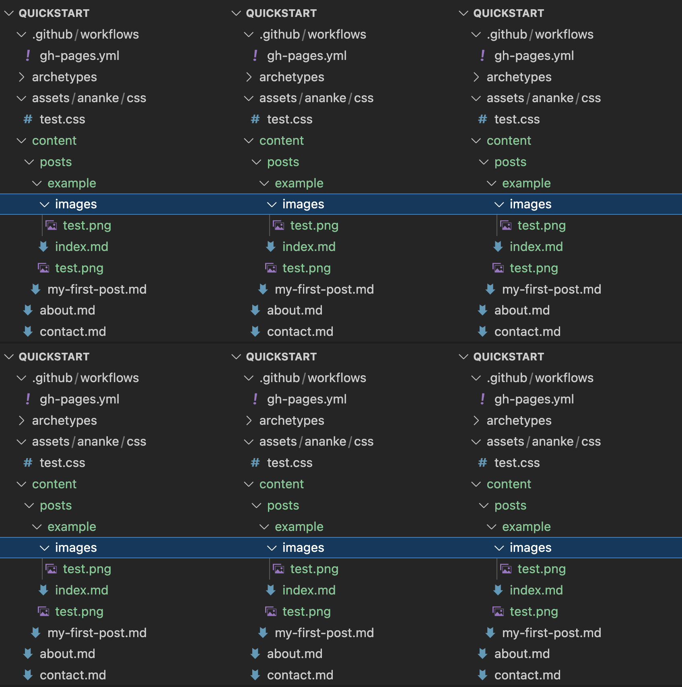

# News & Events

## Local Hobby Expo 2022

* Brunei ABCs and Brunei XYZ Devs were both at the Local Hobby Expo!
Brunei ABCs showcased their recent game jam and Brunei XYZ Devs
shared info about their collective.

## Brunei ABCs
* Joined the Local Hobby Expo - see main item above
* A number of outreach meetups were held in December
* Launched a new Twitter account at [@brunei_abcs_tech](https://twitter.com/brunei_abcs_tech) - do follow!

## LMNOP Brunei
* Not active in Q4 as all members are busy with exams till May 2023!
(Wish them luck, everyone)

## Brunei XYZ Devs
* Joined the Local Hobby Expo - see main item above
* Planning a big event in Mar 2023 - see Opportunities and Support below

# Support & Resources

## Notice Board
* Brunei ABCs asks: How do we find out more about funding for
overseas expos? (Please email / DM on IG / join Discord)
* Brunei XYZ Devs says:

° We have a big event in Mar 2023! We need advice on setting up a
lightweight virtual conference on a budget. (Please whatsapp,
would like to discuss by 31 Jan 2023) - see also Opportunities

° We have 3D printing equipment available for rent at a low rate! It's
at Kg Kiarong and you just need to give us 1 day’s notice @ (Please
whatsapp)

## Resources
* MTIC recently published a list of - very useful for those who
* All the talks from GDG DevFest in Dec 2022 are viewable on YouTube
Video Playlist


# Example Hugo Syntax

- Hugo uses [Markdown](https://www.markdownguide.org/)
- Their docs has [a list to some resources to learn markdown](https://gohugo.io/content-management/formats/#learn-markdown)

## Links

-  **Syntax**
```
[text to link](https://www.domain.com/link)
```
-  Example: 
```
[Markdown](https://www.markdownguide.org/)
```
-  **Output**: [Markdown](https://www.markdownguide.org/)

## Images

-  **Syntax**
```


```
-  Example: 
```

```
-  **Output**: 
-  **Output**: 

## Youtube embed

- [Youtube embed](https://gohugo.io/content-management/shortcodes/#youtube)

-  **Syntax**
```

```
-  Example: 
```

```
-  **Output**: 
